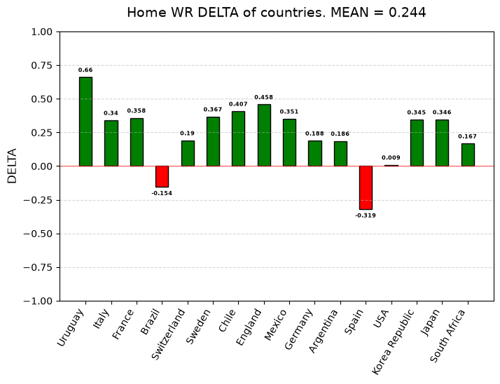

# FIFA World Cup Research (1930–2014)

An exploratory data analysis examining the impact of the "home advantage" across nearly a century of FIFA World Cup tournaments.

### Key Insights 
- **71.4% win rate** for true host nations playing on home soil (with an additional 20.2% ending in draws).
- **+24.4% average win rate increase** ($\Delta$) for host countries during their home tournaments compared to their away World Cup performances.

### Stack
- Python (Pandas, NumPy, Matplotlib)
- Jupyter Notebook
